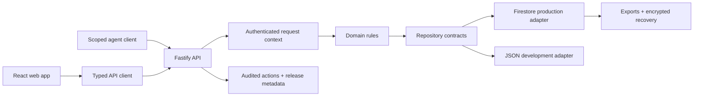

# Northwind CRM: Engineering Overview

> A production relationship-intelligence CRM built around typed domain boundaries, conflict-safe persistence, secure human and agent access, and evidence-driven operations.

## At a glance

| Area                | Implementation                                                                                                                       |
| ------------------- | ------------------------------------------------------------------------------------------------------------------------------------ |
| Product             | Relationship CRM for companies, people, routes, warm introductions, reminders, research intake, and workflow outcomes                |
| Core stack          | Node.js 22, TypeScript, React, Vite, Fastify, Firestore, Terraform                                                                   |
| Architecture        | Workspace monorepo with domain, API client, UI, HTTP, authentication, and repository adapters                                        |
| Production boundary | Hostinger application runtime with Firestore as the sole production store                                                            |
| Verification        | Vitest, Node tests, Firestore emulator tests, Playwright, accessibility checks, visual baselines, CI, dependency and secret scanning |

## Why this project is technically interesting

Northwind is the most production-oriented system in this portfolio. Its complexity comes from keeping data, security, migration, release, and recovery behavior coherent rather than from putting all logic in one application layer.

- **Storage-independent business rules.** Domain entities and invariants do not depend on React, Fastify, authentication, or Firestore.
- **Conflict-safe writes.** Records carry optimistic versions, clients use `If-Match`, and stale updates receive `409 VERSION_CONFLICT` instead of silently overwriting newer work.
- **Workspace isolation.** Request context carries authenticated actor, auth type, workspace, and request ID across the API boundary. Callers cannot supply their own audit identity.
- **Human and agent access are distinct.** Browsers use sessions plus CSRF; desktop agents use scoped, rotatable bearer credentials with hashed tokens and separate read/write permission.
- **Resumable, provenance-aware imports.** Research imports use deterministic IDs, source hashes, persisted jobs, dry-run preview, and idempotent replay.
- **Recovery is engineered as a product capability.** Managed Firestore backups, private cloud exports, encrypted Hostinger archives, checksum validation, and temporary-database restore drills form separate recovery layers.
- **Release claims are exact-SHA claims.** Staging verification and manual promotion are designed to prove that the tested commit is the deployed commit.

## System shape



The legacy root server and static frontend are preserved compatibility surfaces. The authoritative product lives under `apps/` and `packages/`.

## Guided code tour

1. **`packages/domain/src/`** — Storage-independent entities, normalization, integrity rules, and workflow invariants.
2. **`apps/api/src/server.ts`** — Fastify composition, security middleware, route registration, and production static delivery.
3. **`apps/api/src/repositories/`** — JSON, Firestore, session, emulator, and migration adapters behind repository contracts.
4. **`apps/api/src/auth/`** — Shared-login sessions, CSRF, scoped agent tokens, hashing, and authenticated request context.
5. **`apps/api/src/services/`** — Import, migration, backup, restore, owner, and query-key workflows isolated from HTTP.
6. **`apps/web/src/pages/` and `apps/web/src/components/`** — Responsive product workflows for companies, people, routes, imports, reminders, and settings.
7. **`infra/google-cloud/`** — Reviewed infrastructure for Firestore, backups, exports, IAM, scheduling, and budget controls.
8. **`docs/adr/` and `docs/incidents/`** — Durable architecture decisions and failure-derived operational learning.

## Engineering decisions worth discussing

### 1. Domain at the center

Fastify, React, authentication, and persistence are adapters around `packages/domain`. That makes policy testable without booting the UI or connecting to cloud infrastructure.

### 2. Compatibility without architectural drift

The original root server and static frontend remain available for bounded compatibility, while all new product development goes through the typed workspace. This avoids a high-risk rewrite while preventing the legacy surface from becoming authoritative again.

### 3. Safe migration and import

Cloud migration is dry-run first and non-destructive. Research imports persist progress and deterministic identity so interruption or replay cannot casually duplicate records.

### 4. Recovery across independent failure domains

Managed backups protect normal operational recovery, private cloud exports protect data portability, and public-key-encrypted Hostinger archives provide an additional provider boundary. Restore validation happens in a named temporary Firestore database before production is considered.

## Verification

The repository defines layered verification rather than one all-purpose command:

```bash
npm run docs:check
npm run format:check
npm run verify
npm run test:firestore-emulator
npm run build
npm run test:e2e
npm run verify:release
```

The CI workflow also performs a full-history secret scan, formatting, linting, strict type checks, unit/integration tests, Firestore emulator tests, dependency audits, build-artifact verification, and Playwright journeys. Visual regression snapshots cover key pages at desktop and mobile sizes.

## For coding agents

1. Read `AGENTS.md`, `docs/README.md`, and `docs/AI_AGENT_HANDBOOK.md` before editing.
2. Treat the workspace app as authoritative and preserve compatibility surfaces unless a migration is approved.
3. Keep domain rules independent of HTTP, UI, authentication, and persistence.
4. Preserve `workspaceId`, request-derived actors, CSRF, scoped agent auth, optimistic versions, and audited actions.
5. Verify current code and tests before trusting dated cloud or evidence notes.
6. Use the documentation-only, code, UI, or release verification tier appropriate to the change.

## Current boundaries

- The current small-team release uses a shared human login; it is an access gate, not individual identity or role-based access control.
- Some reminders and collaboration behaviors are workspace-wide because of that shared identity.
- Disaster recovery is intentionally operator-led even though backup creation and validation are automated.
- Cloud status documents are configuration snapshots. Current production claims require fresh verification.
- The repository is public for source review but remains unlicensed; viewing the source does not grant reuse rights.

## What this repository demonstrates

Northwind demonstrates end-to-end engineering maturity: typed architecture, security boundaries, concurrency control, cloud persistence, migration discipline, accessibility, CI, incident learning, and recovery design tied together by verifiable operational rules.
